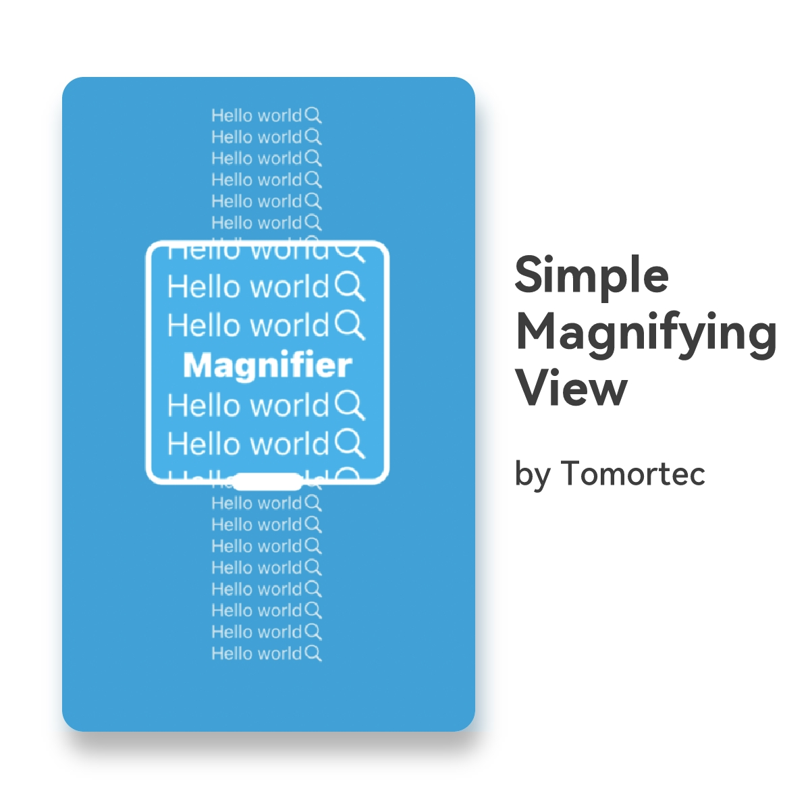
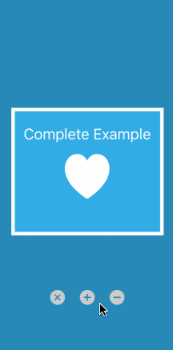
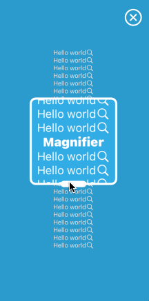
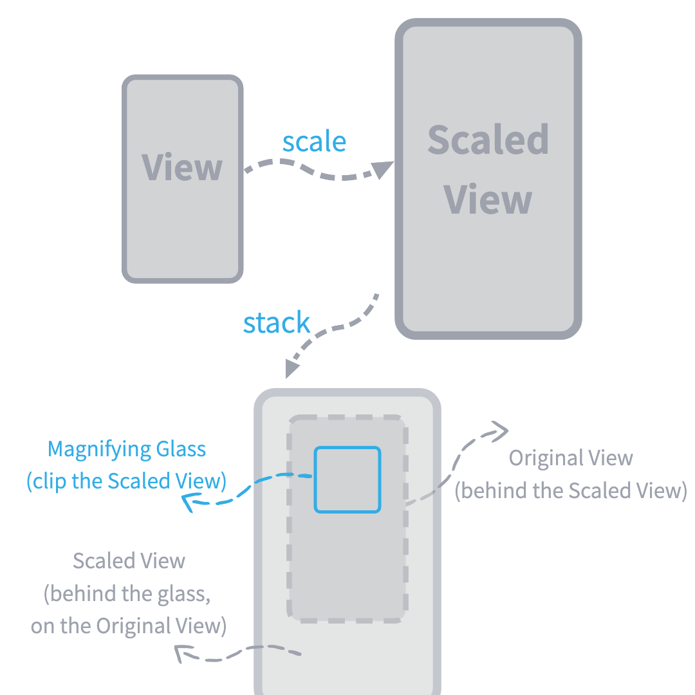

# SimpleMagnifyingView

[](https://cocoapods.org/pods/SimpleMagnifyingView)
[](https://cocoapods.org/pods/SimpleMagnifyingView)
[](https://cocoapods.org/pods/SimpleMagnifyingView)



`SimpleMagnifyingView` 是用 SwiftUI 写的放大镜 🔍




## 原理



## 小示例

``` Swift
MagnifierView(isMagnifying: $isMagnifying, scale: .constant(1.8)) {
    Text("Hello world")
        .foregroundColor(.white)
        .frame(maxWidth: .infinity, maxHeight: .infinity)
        .background(.cyan)
}
.outlineColor(.white)
.closeButtonColor(.white)
```

克隆本仓库，在 `Example` 文件夹执行 `pod install` 后在 `Xcode` 运行示例项目来查看 demo

## 接口

### 初始化
``` swift
init(
    isMagnifying: Binding<Bool>,    // 控制可见性
    scale: Binding<CGFloat> = .constant(2.0),
    glassShape: AnyShape = AnyShape(RoundedRectangle(cornerRadius: 12.0)),
    @ViewBuilder _ content: () -> Content
)
```

### 有关放大镜的方法
``` swift
// 调整放大镜的尺寸
func magnifyingGlassSize(_ size: CGSize)

// 设置放大镜的形状
func magnifyingGlassShape(_ shape: AnyShape)

// 设置把柄的宽度比例（相对于放大镜的宽度）
func handleWidthRatio(_ ratio: CGFloat)

// 设置把柄的高度
func handleHeight(_ height: CGFloat)

// 设置放大镜的边框颜色
func outlineColor(_ color: Color)

// 设置放大镜的边框宽度
func outlineWidth(_ width: CGFloat)

// 是否允许在放大镜内交互
func enableHitInMagnifyingGlass(_ enabled: Bool)
```

### 有关 mask 的方法
``` swift
// 设置 mask 的背景颜色
func maskBackgroundColor(_ color: Color)

// 设置关闭按钮的尺寸
func closeButtonSize(_ size: CGSize)

// 设置关闭按钮的颜色
func closeButtonColor(_ color: Color)

// 是否显示关闭按钮
func enableCloseButton(_ enabled: Bool)
```

执行 Xcode 的 `Product > Build Documentation` 并前往文档中心来查看 `SimpleMagnifyingView` 的更多接口细节

## Swift 版本

Swift >= 5.0

## 安装方法

`SimpleMagnifyingView` 已在 [CocoaPods](https://cocoapods.org)发布。添加下列命令到你的 `Podfile` 来安装 `SimpleMagnifyingView`:

```ruby
pod 'SimpleMagnifyingView'

# 注意：如果您的 pod 没找到 `SimpleMagnifyingView`, 请使用下面的命令重试
# pod `SimpleMagnifyingView`, :git => 'https://github.com/Tomortec/SimpleMagnifyingView.git'
```

## 作者

Tomortec, everything@tomortec.com

## License

SimpleMagnifyingView is available under the MIT license. See the LICENSE file for more info.
