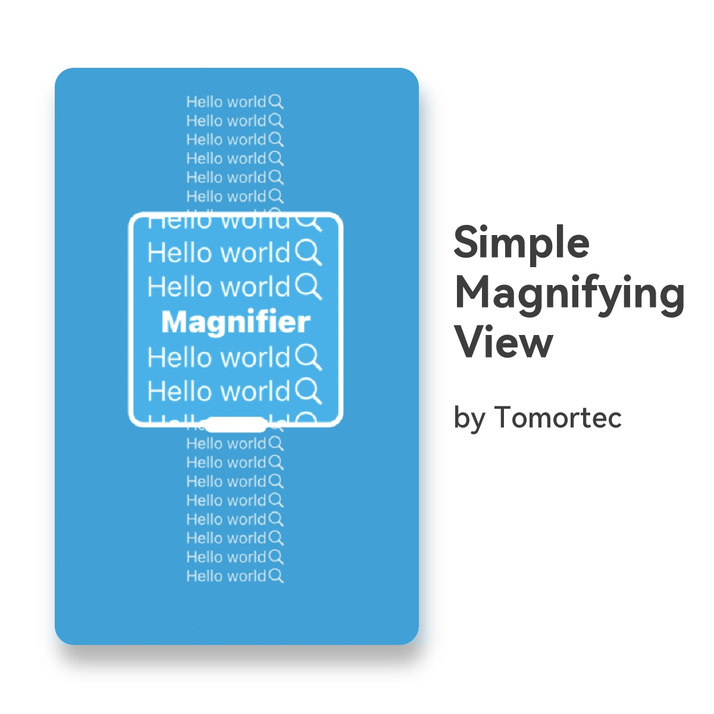
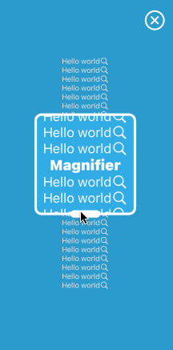
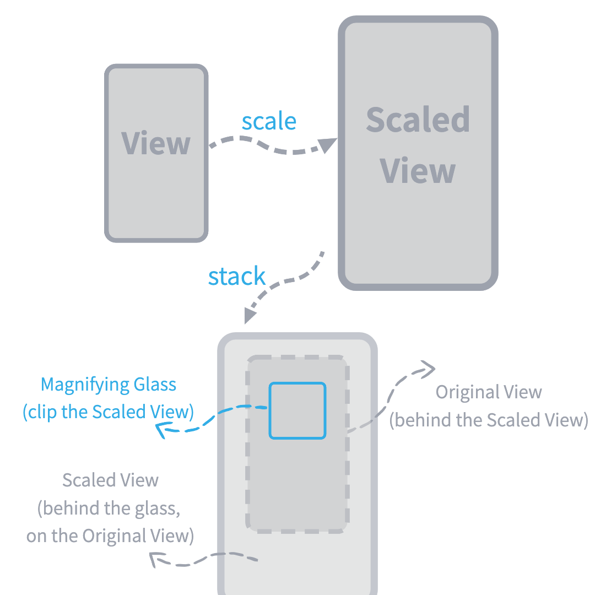

# SimpleMagnifyingView



`SimpleMagnifyingView` is a SwiftUI view which can create a magnifier

[中文说明](./README-zh.md)

<p float="left">
     
    
</p>

## How it works



## Example

``` Swift
MagnifierView(isMagnifying: $isMagnifying, scale: .constant(1.8)) {
    Text("Hello world")
        .foregroundColor(.white)
        .frame(maxWidth: .infinity, maxHeight: .infinity)
        .background(.cyan)
}
.outlineColor(.white)
.closeButtonColor(.white)
```

To run the example project, clone the repo, and run `pod install` from the Example directory first.

## Interfaces

### Initialization
``` swift
init(
    isMagnifying: Binding<Bool>,    // control the visibility
    scale: Binding<CGFloat> = .constant(2.0),
    glassShape: AnyShape = AnyShape(RoundedRectangle(cornerRadius: 12.0)),
    @ViewBuilder _ content: () -> Content
)
```

### Methods for magnifying glass
``` swift
// Config the size of the magnifying glass
func magnifyingGlassSize(_ size: CGSize)

// Config the shape of the magnifying glass
func magnifyingGlassShape(_ shape: AnyShape)

// Set the scale of the handle width
func handleWidthRatio(_ ratio: CGFloat)

// Set the height of the handle
func handleHeight(_ height: CGFloat)

// Set the outline color of the magnifying glass
func outlineColor(_ color: Color)

// Set the outline width of the magnifying glass
func outlineWidth(_ width: CGFloat)

// Enable or disable interactions in the magnifying glass
func enableHitInMagnifyingGlass(_ enabled: Bool)
```

### Methods for mask
``` swift
// Set the background color of the mask
func maskBackgroundColor(_ color: Color)

// Set the size of the close button
func closeButtonSize(_ size: CGSize)

// Set the foreground color of the close button
func closeButtonColor(_ color: Color)

// Enable or disable(or hide) close button
func enableCloseButton(_ enabled: Bool)
```

Execute Xcode's `Product > Build Documentation` and go to `SimpleMagnifyingView`'s documentation for more details.

## Requirements

Swift >= 5.0

## Installation

SimpleMagnifyingView is available through [CocoaPods](https://cocoapods.org). To install
it, simply add the following line to your Podfile:

```ruby
pod 'SimpleMagnifyingView'

# Note that if cocoapods cannot find `SimpleMagnifyingView`, please try the command below
# pod `SimpleMagnifyingView`, :git => 'https://github.com/Tomortec/SimpleMagnifyingView.git'
```

## Author

Tomortec, everything@tomortec.com

## License

SimpleMagnifyingView is available under the MIT license. See the LICENSE file for more info.
